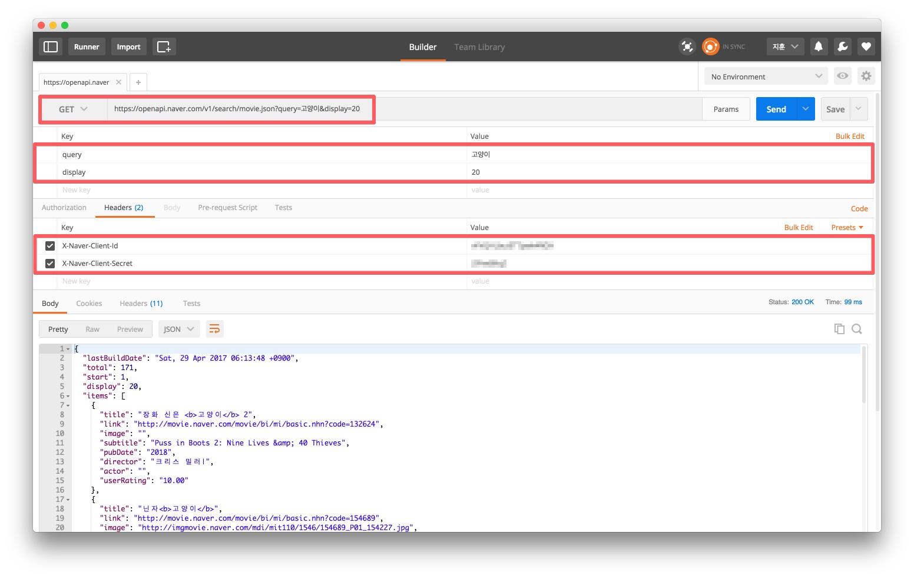
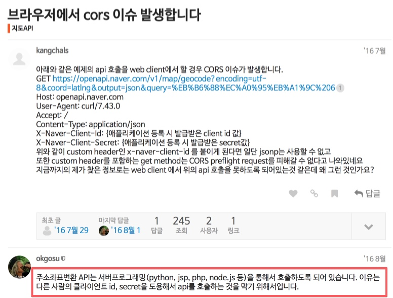

# NAVER 영화 검색 API

[네이버 영화 검색 결과를 출력해주는 REST API](https://developers.naver.com/docs/search/movie/)입니다. 비로그인 오픈 API이므로 GET으로 호출할 때
HTTP Header에 애플리케이션 등록 시 발급받은 Client ID와 Client Secret 값을 같이 전송해 주시면 활용 가능합니다.

```sh
# Client ID
vFhQHLbutxxxxxxxxxx
# Client Secret
Zfihsxxxxx
```

<!--
# Client ID
vFhQHLbutETTjzwk4RGH
# Client Secret
Zfihs68IqZ
-->

### 영화 API 기본 정보

`https://openapi.naver.com/v1/search/movie.json`

### 요청 변수(Parameter)

요청 변수명 | 타입 | 필수 여부 | 기본값 | 설명
-------- | --- | ------- | ---- | ---
query | string (필수) | Y | - | 검색을 원하는 질의. UTF-8 인코딩이다.
display | integer | N | 기본값 10, 최대 100 | 검색 결과 출력 건수를 지정한다. 최대 100까지 가능하다.
start | integer | N | 기본값 1, 최대 1000 | 검색의 시작 위치를 지정할 수 있다. 최대 1000까지 가능하다.
genre | string | N | - | 검색을 원하는 장르 코드를 의미한다. 영화 코드는 다음과 같다.
 | | | | | 1: 드라마, 2: 판타지
 | | | | | 3: 서부, 4: 공포
 | | | | | 5: 로맨스, 6: 모험
 | | | | | 7: 스릴러, 8: 느와르
 | | | | | 9: 컬트, 10: 다큐멘터리
 | | | | | 11: 코미디, 12: 가족
 | | | | | 13: 미스터리, 14: 전쟁
 | | | | | 15: 애니메이션, 16: 범죄
 | | | | | 17: 뮤지컬, 18: SF
 | | | | | 19: 액션, 20: 무협
 | | | | | 21: 에로, 22: 서스펜스
 | | | | | 23: 서사, 24: 블랙코미디
 | | | | | 25: 실험, 26: 영화카툰
 | | | | | 27: 영화음악, 28: 영화패러디포스터
country | string | N | - | 검색을 원하는 국가 코드를 의미한다. 국가코드는 대문자만 사용 가능하며, 분류는 다음과 같다.
| | | | | 한국 (KR)
| | | | | 일본 (JP)
| | | | | 미국 (US)
| | | | | 홍콩 (HK)
| | | | | 영국 (GB)
| | | | | 프랑스 (FR)
| | | | | 기타 (ETC)
yearfrom | integer(ex : 2000) | N | - | 검색을 원하는 영화의 제작년도(최소)를 의미한다. yearfrom은 yearto와 함께 사용되어야 한다.
yearto | integer(ex : 2008) | N | - | 검색을 원하는 영화의 제작년도(최대)를 의미한다. yearto는 yearfrom과 함께 사용되어야 한다.

### 사용 예시

```sh
$ curl "https://openapi.naver.com/v1/search/movie.json?query={사용자 입력 검색어}&display=10&genre=1" \
    -H "X-Naver-Client-Id: {애플리케이션 등록 시 발급받은 client id 값}" \
    -H "X-Naver-Client-Secret: {애플리케이션 등록 시 발급받은 client secret 값}" -v
```

<!-- curl "https://openapi.naver.com/v1/search/movie.json?query=%EA%B3%A0%EC%96%91%EC%9D%B4&display=10&genre=1" \
-H "X-Naver-Client-Id: vFhQHLbutETTjzwk4RGH" \
-H "X-Naver-Client-Secret: Zfihs68IqZ" -v -->

### POSTMAN

Chrome Extension [POSTMAN](https://chrome.google.com/webstore/detail/postman/fhbjgbiflinjbdggehcddcbncdddomop)은 REST/HTTP API를 개발할 때 유용하게 사용 할 수 있는 클라이언트입니다.



### CORS

> CORS (Cross-Origin Resource Sharing)
> 웹 브라우저에서 외부 도메인 서버와 통신하기 위한 방식을 표준화한 스펙이다.
> 서버와 클라이언트가 정해진 해더를 통해 서로 요청이나 응답에 반응할지 결정하는 방식으로 교차 출처 자원 공유(cross-origin resource sharing)라는 이름으로 표준화가 되었다.

참고 글 [JavaScript Ajax 크로스 도메인 요청 - CORS](https://brunch.co.kr/@adrenalinee31/1)

NAVER 영화 API는 서버프로그래밍(python, jsp, php, node.js 등)을 통해서만 호출하도록 되어 있습니다.
이유는 다른 사람의 클라이언트 id, secret을 도용해서 api를 호출하는 것을 막기 위해서입니다.



---

### MyJSON API

[Myjson](http://myjson.com/)은 클라이언트 측 웹/모바일 응용 프로그램에서 사용하기 위한 간단한 JSON 저장소 입니다. (CORS 허용)

구성 파일이나 클라이언트 측 모델용 데이터를 저장할 장소가 필요하신 분이라면 Myjson을 사용하실 수 있습니다.
JSON 데이터를 복사하여 기본 입력 윈도우에 붙여넣기만 하면 제공된 URI를 통해 데이터에 액세스 할 수 있습니다.
더 많은 기능을 보려면 [API](http://myjson.com/api)를 확인해보세요.

Myjson URI는 CORS(Cross-Origin Resource Sharing)를 지원하므로 데이터 클라이언트 측에 액세스해도 도메인 간 문제가 발생하지 않습니다.

```js
var naver_movie_api = [
  'https://api.myjson.com/bins/1cvje9',
  'https://api.myjson.com/bins/13y1bl',
  'https://api.myjson.com/bins/1h1kmp'
];

var settings = {
  "url": naver_movie_api[0],
  "method": "GET"
}

$.ajax(settings).done(function (response) {
  console.log(response);
});
```

---

### randomuser.me API

애플리케이션 테스트를 위한 임의 사용자 데이터를 생성/제공하는 무료 서비스.

#### 기본 사용법

```js
$.ajax({
  url: 'https://randomuser.me/api/',
  dataType: 'json'
})
.done(function(response){
  console.log(response);
});
```

#### 파라미터 설정 사용법

[randomuser.me API](https://randomuser.me/documentation) 참고

```js
$.ajax({
  url: 'https://randomuser.me/api2/',
  data: {
    results: 10,
    page: 1,
    seed: 'yamoo9',
    inc: 'gender, name, email, picture',
    // noinfo: true,
  },
  dataType: 'json'
})
.done(function(response) {
  console.log(response);
})
.fail(function(error) {
  console.error(error.message);
});
```

---

### Unsplash API

[Unsplash API](https://unsplash.it/)

#### 사용법

가로/세로 길이가 설정된 이미지

`https://unsplash.it/200/300`

가로/세로 길이가 동일한 정사각형 이미지

`https://unsplash.it/200`

랜덤 이미지

`https://unsplash.it/200/300/?random`

흑백 이미지

`https://unsplash.it/g/200/300`

이미지 리스트

`https://unsplash.it/list`

개별 이미지

`https://unsplash.it/600/240?image=349`

블러 이미지

`https://unsplash.it/600/240?image=349&blur`


이미지 자르기

- 상, north
- 우, east
- 하, south
- 좌, west
- 중앙, center

`https://unsplash.it/240/240/?image=349&gravity=east`<br>
`https://unsplash.it/240/240/?image=349&gravity=center`
