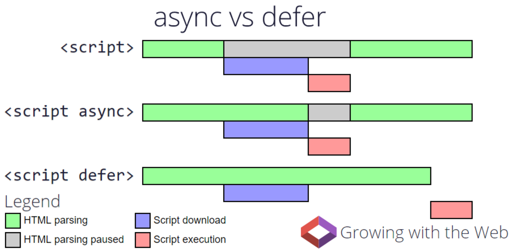
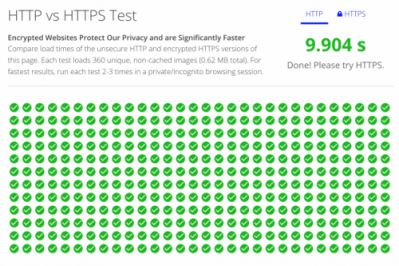
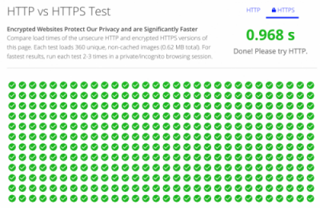

###### 2017. 02. 25

# DAY 01

### How much do you know about JavaScript?

[사전조사 설문](https://goo.gl/JJqE7h)

-

### 컴퓨터 관점에서 생각하기(Computational Thinking)

프로그래밍이란? 명령을 컴퓨터에게 전달하는 커뮤니케이션(Communication) 행위로, 컴퓨터가 이해할 수 있는 명령으로 프로그래머가 요구하는 실행이 가능하도록 구현하는 것을 말한다. 컴퓨터는 인간이 아니기에 사고 방식이 달라, 사람이 생각하는데로 이야기를 전하면 컴퓨터는 이를 이해하지 못한다.

요컨대 <u>컴퓨터 관점에서 이야기를 풀어가지 않으면 프로그래밍을 잘 할 수 없다.</u> 프로그래밍 언어를 처음 접하는 사람이 어렵다 느끼는 이유는 여기에 있다. 어른의 시각에서 아이의 생각을 알 수 없듯이, 사람이 행하는 일반적 사고 방식으로는 컴퓨터에 명령을 내리기 어렵기 때문이다.

프로그래밍은 문법에 부합하는 것은 물론이고 수행하고자 하는 바를 정확히 수행하는 것 즉, 요구사항이 실현되어야 의미가 있다.

이것을 위하여 일반적 프로그래밍 언어는 **변수**와 **값**, **키워드**, **연산자**, **표현식**, **조건문**과 **반복문**에 의한 흐름제어(Flow control), 구문의 집합인 **함수** 그리고 **객체**, **배열** 등의 자료구조를 제공한다.

- 변수
- 값
- 연산자
- 표현식
- 조건문
- 반복문
- 함수
- 객체
- 배열

프로그래밍이 수행하는 일을 정의하면 변수를 통해 값을 저장하고 참조하며 연산자로 값을 연산, 평가하고 조건문과 반복문에 의한 흐름제어로 데이터의 흐름을 제어하고 함수로 구문의 집합을 만들며 객체, 배열 등으로 자료를 구조화한다.

> 프로그래밍은 요구사항의 집합을 분석하여 적절한 자료구조와 함수의 집합으로 변환한 후 그 흐름을 제어하는 것이다.

[#computational-thinking](http://poiemaweb.com/coding)

-

### JavaScript 프로그래밍 환경

JavaScript는 <u>웹 브라우저 환경에서 유일하게 동작하는 프로그래밍 언어</u>로, 멀티 패러다임 개발 방법을 제공하는 Programming Language이다. C, JAVA 언어에서 많은 문법을 차용하였을 뿐 아니라, Awk, Perl, Python 등 다른 언어의 영향도 받았다. 웹 브라우저에서 바로 해석되어 사용되는 인터프리터(Interpreter) 언어로 컴파일 과정 없이 HTML 문서에 직접 작성이 가능하다.

초창기 웹 브라우저 환경에 국한되어 사용되었던 것과 달리 현재는 다양한 환경에서도 JavaScript가 사용되고 있다. 대표적으로 Google Chrome V8 엔진을 기초로 하는 Node.js가 있다.

[#javascript-introduction](http://poiemaweb.com/js-introduction)

-

### JavaScript 기본기 다지기

- 기본 문법 공부
- 웹 브라우저에서의 작동 원리 공부
- 이벤트 기반 처리 프로그래밍에 대한 이해/실습

-

### 수업 진행내용

- **[GitHub.com](http://github.com/)서비스 이용**
  - [GitHub Desktop](https://desktop.github.com/) GUI 도구 설치 및 사용법 학습.
- **자바스크립트 실행 흐름**
  - 동기(직렬, Sync) 및 비동기(병렬, Async) 처리 방식
  - `defer`/`async` 속성 활용
- **이벤트 기반 프로그래밍**
  - `load` 이벤트 발생 시, 처리(`function`) 실행 과정
- **자바스크립트 변수 이름 작성 규칙**
  - 대문자를 포함할 수 있지만, 모두 대문자만으로는 사용하지 않는다.
  - 이름 사이 공백 및 특수문자(`_`, `$` 제외)가 와서는 안된다.
  - 숫자가 맨 앞에 와서는 안된다.

-

#### [Defer, Async 처리 인포그래픽](http://www.growingwiththeweb.com/2014/02/async-vs-defer-attributes.html)

일반적인 호출/실행 과정  vs  `async` 호출/실행 과정  vs  `defer` 호출/실행 과정

-

#### [HTTP/1.1 vs HTTP/2](http://www.popit.kr/%EB%82%98%EB%A7%8C-%EB%AA%A8%EB%A5%B4%EA%B3%A0-%EC%9E%88%EB%8D%98-http2/)

##### 현재의 HTTP/1.1 단점

기본적으로 Connection당 하나의 요청을 처리 하도록 설계. 동시전송이 불가능, 요청과 응답이 순차적으로 이루어 짐. HTTP 문서 안에 포함된 다수의 리소스 (Images, CSS, Script) 처리할 때 요청할 리소스 개수에 비례 해서 Latency(대기 시간)는 길어짐..

-

##### 우리의 눈물겨운 노력들

여러 개의 이미지를 한 장에 모으는 스프라이트 이미지를 만드는 이유는 성능(속도) 때문. CSS, JS 파일 압축하는 이유도 성능(속도) 때문. 여러 개로 분산 관리되는 CSS, JS를 하나로 번들링하는 이유도 성능(속도) 때문. CSS는 `<head>` 영역에서 불러오 JS는 `</body>` 앞에서 불러와야 하는 이유도 성능(속도) 때문. "**이 모든게 다 HTTP/1.1 때문이다.**"

    HTTP/1.1                                                         HTTP/2

