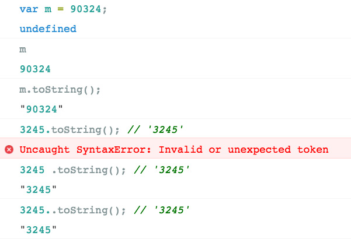
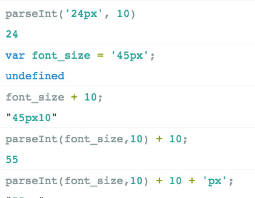
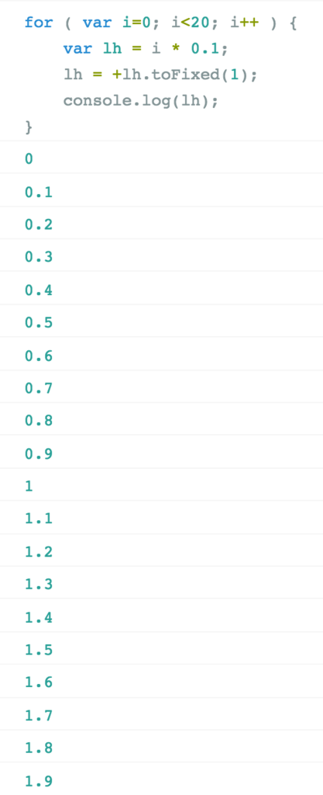

###### 2017. 03. 04

# DAY 02

### 1일차 학습 내용 검토 Quiz

아래 링크를 클릭한 후 질문 항목에 답변해주세요.

[D1 REVIEW](https://goo.gl/forms/OMam33sFrDBxFgBB3)

### Sublime Text Editor Screencast

[Sublime Text 3 마스터링 코스 by 야무(yamoo9)](https://www.inflearn.com/course/sublime-text-3-%EB%A7%88%EC%8A%A4%ED%84%B0%EB%A7%81-%EC%BD%94%EC%8A%A4/)

---

### JavaScript 구문

프로그램(스크립트)은 컴퓨터(Client-side Javascript의 경우, 엄밀히 말하면 웹 브라우저)에 의해 단계별로 수행될 명령들의 집합이다.

각각의 명령을 statement(구문)이라 하며 statement가 실행되면 무슨 일인가가 일어나게 된다. 구문은 값(Values), 연산자(Operators), 표현식(Expressions), 키워드(Keywords), 주석(Comments)으로 구성되며 세미콜론(`;`)으로 끝나야 한다.

```js
var robot = '태권 V';
var body  = document.querySelector('body');
```

#### 표현식(Expression)

표현식(Expression)은 값, 변수, 연산자의 조합이며 이 조합은 값을 연산한다.<br>
즉, 표현식은 하나의 값으로 평가(연산, 계산)될 수 있는 문장이다.

```js
( (10 - 2) * x ) % y;
'오늘 하루도' + mood + '행복하세요.';
```

#### 변수(Variables)

프로그래밍 언어에서 변수는 데이터(자료)를 저장(할당), 참조하기 위해 사용된다. 한 번 쓰고 버리는 값이 아닌 값(value)을 유지(기억)할 필요가 있는 경우에 변수를 사용한다. 변수를 선언할 때 `var` 키워드가 사용된다. 할당연산자(`=`)는 변수에 값을 할당하기 위해 사용된다.

<br>


아래의 예에서는 `our_plan` 이름의 변수를 선언한 후, 변수 `our_plan`에 문자 값 `'36계 줄행랑'`을 할당했다.

```js
var our_plan;           // 변수 선언과 초기화
our_plan = '36계 줄행랑'; // 문자 값을 할당(대입)
```

#### 값(Value)

JavaScript는 리터럴(literal)을 통해 값을 사용한다. 리터럴이란? 값을 표현하는 방식이다. 그리고 값은 대부분 변수에 저장된다.

```js
9.01         // 숫자 값 (Literal: Number Value)
'보온/재가열'   // 문자 값 (Literal: String Value)
true         // 논리 값 (Literal: Boolean Value)
function(){} // 함수 값 (Literal: Function Value)
[]           // 배열 값 (Literal: Array Value)
{}           // 객체 값 (Literal: Object Value)
```

#### 연산자 (Operator)

연산자(Operators)는 하나 혹은 그 이상의 값을 하나의 값으로 만들 때 사용한다.

```js
// 대입 연산자
var listen_to_music = '음악을 듣다.';

// 산술 연산자
var multiply_numbers = 9 * 3;

// 문자열 연산자
var message = '저항이 있다는 것은 ' + '세상을 바꾸고 있다는 증거지.';

// 비교 연산자
var greater_than = multiply_numbers > 21; // true

// 논리 연산자
var boo = (11 < -1) || (0 > 1);  // false
```

#### 키워드 (keyword)

키워드(keyword)는 수행되어져할 동작을 규정한 것이다. 예를 들어 `var` 키워드는 브라우저에게 새로운 변수를 생성할 것을 지시한다.

키워드 / 예약어 | | | |
--- | --- | --- | --- | ---
abstract | arguments | boolean | break | byte
case | catch | char | class | const
continue | debugger | default | delete | do
double | else | enum | eval | export
extends | false | final | finally | float
for | function | goto | if | implements
import | in | instanceof | int | interface
let | long | native | new | null
package | private | protected | public | return
short | static | super | switch | synchronized
this | throw | throws | transient | true
try | typeof | var | void | volatile
while | with | yield | |


#### 주석 (Comment)

주석(Comment)은 작성된 코드의 의미를 설명하기 위해 사용한다. 코드는 읽기(이해하기) 쉬워야 한다(가독성이 좋아야 한다)

여러분이 작성한 코드를 다른 누군가가 읽는다면 “아니, 이게 뭐하는 코드야?”라고 생각하는 순간이 있기 마련이다. 여러분이 해야 하는 일은 바로 그런 부분에 주석을 다는 것이다. (읽기 좋은 코드가 좋은 코드이다)

한줄 주석은 `//` 다음에 작성하며 여러 줄 주석은 `/*`과 `*/`의 사이에 작성한다. 주석은 해석기가 무시하며 실행되지 않는다.

```js
/*
 * 로봇 시대
 * 제목/슬로건 설정
 */

// 로봇 제목 설정:
document.getElementById("robot-heading").innerHTML = '로봇 시대를 열다.';
// 로봇 슬로건 설정:
document.getElementById("robot-slogan").innerHTML = "성큼 다가온 로봇 시대! 공존 방식은?";
```

[#js-syntax-basics](http://poiemaweb.com/js-syntax-basics)

---

###  Data Type (자료형)

모든 프로그래밍 언어의 학습은 Data Type(자료형)을 파악하는 것으로부터 시작된다.

자료형은 프로그래밍 언어에서 객체, 정수, 불린 등 여러 종류의 데이터를 식별하는 분류를 말한다.
최신 ECMAScript 표준(ECMAScript 2015 (6th Edition, ECMA-262) / 2015.06)은 7개의 자료형을 정의하고 있다.

#### 기본 자료형 (primitive data type)

- Boolean
- null
- undefined
- Number
- String
- Object
- Symbol (New in ECMAScript 2015)

Javascript의 자료형은 크게 **기본 자료형(Primitive Data Type)**과 **Object(객체형, 참조형)**으로 구분할 수 있다.

-

#### 기본 자료형 (Primitive Data Type)

기본자료형(Primitive data type)의 값은 변경 불가능한 값(immutable value)이다.

##### Number

C 언어의 경우, 정수형과 실수형을 구분하여 `int`, `long`, `float`, `double` 등과 같은 다양한 숫자 자료형이 존재한다. 하지만 자바스크립트는 하나의 숫자 자료형만 존재한다.

ECMAScript 표준에 따르면, 숫자 자료형은 배정밀도 64비트 부동 소수점 형 (double-precision 64-bit floating-point format : -(253 -1) 와 253 -1 사이의 숫자값) 단 하나만 존재한다. 정수만을 표현하기 위한 특별한 자료형(Integer Type)은 없다.

추가적으로 세가지 의미있는 기호적인 값들도 표현할 수 있다.

- +/- Infinity
- NaN (not-a-number)

---

###### JavaScript의 이상한 처리



---

###### 단위를 가지는 값에서 숫자만 빼오는 방법



###### 문자를 숫자로 변경할 때 앞에 `+` 기호를 붙여 처리하는 방법

숫자`.toFixed(`남겨둘 소수점 개수 설정`)` 방법의 반환 값(return value)은 문자(숫자형 문자)이므로 숫자로 변경해야 연산 처리가 가능하다.



---

##### String

String(문자열) 타입은 텍스트 데이터를 나타내는데 사용한다. 이는 0개 또는 그 이상의 유니코드(16비트 부호없는 정수 값) 문자들의 집합이다. 문자열은 작은 따옴표(`''`) 또는 큰 따옴표(`""`) 안에 텍스트를 넣어 생성한다.

C와 같은 언어와는 다르게, 자바스크립트의 문자열은 변경 불가능(immutable) 하다. 이것은 한 번 문자열이 생성되면, 그 문자열을 변경할 수 없다는걸 의미한다.

문자열은 배열처럼 인덱스를 통해 접근할 수 있다. `str[0] = 'S'`처럼 이미 생성된 문자열에 새로운 문자를 대입하여 변경시켜도 반영되지 않는다(이때 에러가 발생하지 않는다). 한번 생성된 문자열은 읽기 전용(Read Only)로서 수정은 불가하다. 이것을 변경 불가능(Immutable)이라 한다.

그러나 새로운 문자열을 할당하는 것은 물론 가능하다. 이는 기존 문자열을 수정하는 것이 아닌 새로운 문자열을 할당하는 것이기 때문이다.


##### Boolean

논리적인 요소를 나타내며 `true`와 `false` 두가지 값을 가질 수 있다.
비어있는 문자열과 `null`, `undefined`, 숫자 `0`은 `false`로 간주된다.

##### null

`null` 타입은 딱 한 가지 값, `null`을 가질 수 있다. JavaScript는 대소문자 구분(case-sensitive)하므로 `null`은 `Null`, `NULL`등과 다르다.
컴퓨터 과학(Computer Science)에서 `null`은 의도적으로 기본형(Primitives) 또는 객체형(Object) **변수에 값이 없다는 것을 명시한 것**이다.

##### undefined

값을 할당하지 않은 변수는 `undefined` 값을 가진다. 즉, 선언은 되었지만 할당된 적이 없는 변수에 접근하거나 존재하지 않는 객체 프로퍼티에 접근할 경우 반환된다.

---

#### Object (객체형, 참조형)

객체는 데이터와 그 데이터에 관련되는 동작(절차,방법,기능)을 모두 포함할 수 있는 개념적 존재이다. 달리 말해, 이름과 값을 가지는 데이터를 의미하는 속성(Property)와 동작을 의미하는 메서드(Method)를 포함하고 있는 독립적 주체이다.

자바스크립트는 객체(Object)기반의 스크립트 언어이며 **자바스크립트를 이루고 있는 거의 모든 것**은 **객체**이다. 기본자료형(Primitives)을 제외한 나머지 값들(배열, 함수, 정규표현식 등)은 모두 객체이다. 아래 나열된 것은 모두 객체이다.

- 함수 (Function)
- 배열 (Array)
- 날짜 (Date)
- 정규식 (RegExp)

-

#### 값 참조와 복사

- 값 복사([Pass by Value](http://poiemaweb.com/js-object#5-pass-by-value))
- 값 참조([Pass by Reference](http://poiemaweb.com/js-object#4-pass-by-reference))

<br>

[#js-data-type-variable](http://poiemaweb.com/js-data-type-variable)
