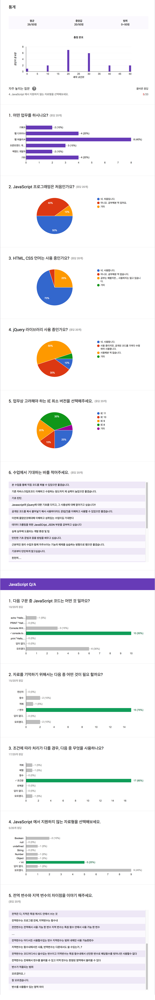

###### JJ CAMP Fundamental

## 진행 내용 목차

참고 학습을 위해 수업 진행 내용을 기록.

> 1. __[02.25](./LOG/0225.md)__ | 컴퓨터적인 사고로 프로그래밍 하기 / JavaScript 환경 & 기초 문법
> 1. __[03.04](./LOG/0304.md)__ | 변수와 상수, 연산자. 그리고 JavaScript 자료 구조
> 1. __[03.11](./LOG/0311.md)__ | JavaScript 자료형, 함수와 배열 객체 데이터
> 1. __[03.18](./LOG/0318.md)__ | JavaScript 자료형 체크, 문제와 해결책
> 1. __[03.25](./LOG/0325.md)__ | 지금까지 배운 내용 다시 한 번 훓어보기 및 조건 처리 구문
> 1. __[04.01](./LOG/0401.md)__ | JavaScript 조건/반복 구문, 배열과 반복 구문
> 1. __[04.08](./LOG/0408.md)__ | JavaScript 함수와 this, scope, 실행 컨텍스트
> 1. __[04.15](./LOG/0415.md)__ | jQuery 기본기 다지기 1 및 실습 자료 jQuery 화
> 1. __[04.22](./LOG/0422.md)__ | jQuery 기본기 다지기 2 및 UI 오프캔버스 메뉴 구현 실습
> 1. __[04.29](./LOG/0429.md)__ | jQuery 기본기 다지기 3 및 UI 컴포넌트 구현 실습

<!-- ## 수강생 분들께 부탁드립니다.

개인적인 사정으로 4월 1일 수업은 오후 3시부터 오후 7시까지 진행하는 방향에 대해 의견을 듣고자 합니다.
진행못한 1시간 분량의 수업은 추후 보충을 하고자 하는데요. 괜찮으실지 의견 부탁드립니다. 감사합니다.

[의견 설문](https://goo.gl/forms/oK6NZ0GqAjV7SRvl1)

#### 설문 결과

- 응답해주신 모든 분들께서 4/1 오후 3시 수업 시작을 용인해주셨습니다. 감사합니다.
- 2일(4/8, 4/15)에 걸쳐 30분씩 보강하는 방향으로, 저녁 7시 30분까지로 결정하겠습니다. (기타 의견 반영)

 -->

<!-- ---

### JJ CAMP 첫걸음, 2기 멤버

2기 멤버들은 함께 공부하는 분들과 친해지는 것입니다! 
서로 서로 친하게 지내 봅시다! 10주간 잘 부탁해요!

 | 이름 | 업무 | 소속 | 이메일 | GitHub
--- | --- | --- | --- | --- | --- | ---
01 | 박지훈 | IT | KB | jeehoon0310@gmail.com | [github.com/jeehoon0310](https://github.com/jeehoon0310)
02 | 노현석 | 프리랜서 | | raijin8703@naver.com | [github.com/raijin8703](https://github.com/raijin8703)
03 | 김득원 | 컨설팅(ERD) | MSND | dkim@msnd.kr | [github.com/dkim1004](https://github.com/dkim1004)
04 | 윤종경 | 웹 퍼블리셔 | 다나와 | jkyoon@me.com | [github.com/respectedy](http://github.com/respectedy)
05 | 이정선 | 웹 퍼블리셔 | 와 | lee.jeongsun5@gmail.com | [github.com/jslee0728](https://github.com/jslee0728)
06 | 한창민 | 프리랜서 |  | cmhan@fine-tec.com | [github.com/dooly9](https://github.com/dooly9)
07 | 이혜원 | 디자이너 | ENT | hwlee0507@hanmail.net | [github.com/hw0507](http://github.com/hw0507)
08 | 최유리 | 마케터 | SKT | yuriran@naver.com | [github.com/yuriran](https://github.com/yuriran)
09 | 천송희 | 디자이너 | 지투아이넷 | superluckhee@naver.com | [github.com/superluckhee](https://github.com/superluckhee)
10 | 강다인 | 대학생 | 세종대학교 | juhyueon3@naver.com |
11 | 박봉준 | 웹 퍼블리셔 | 아메바 | darksun3@nate.com | [github.com/bongpark](https://github.com/bongpark)
12 | 이상종 | 프리랜서 |  | feuuis@naver.com | [github.com/Sangjong](https://github.com/Sangjong)
13 | 김보민 | 웹 퍼블리셔 | 하나투어유스 | minn1144@naver.com | [github.com/minn1144](https://github.com/minn1144)
14 | 김승현 | 프리랜서 |  | dhxn5ak@gmail.com |
15 | 한혜영 | 웹 디자이너 | 인디존 | skylemon7879@naver.com | [github.com/eyeray](https://github.com/eyeray)
16 | 이상구 | 개발 | 엑셈 | tkdrn0842@naver.com | [github.com/tkdrn808](https://github.com/tkdrn808)
17 | 이혜진 | 웹 퍼블리셔 | SBS 콘텐츠 허브 | penguin90@sbs.co.kr | [github.com/penguin90](https://github.com/penguin90)
18 | 유진희 | 프리랜서 |  | yashicafx3@naver.com | [github.com/ujinhee](https://github.com/ujinhee)
19 | 김형진 | 개발 | 씨와이디정보기술 | hjshuma@gmail.com | [github.com/hjshuma](https://github.com/hjshuma)
20 | 고청요 |  |  | all.new.chch@gmail.com | [github.com/float-ing](https://github.com/float-ing) -->

<!-- ### 사전 설문(Pre Survey) 결과

 -->
